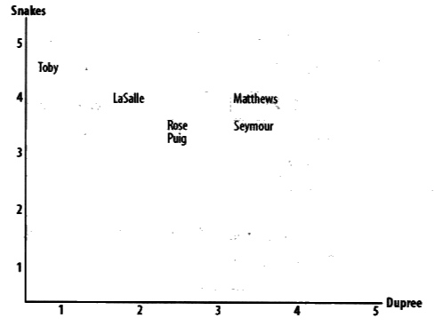
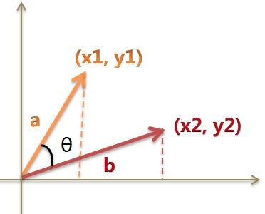
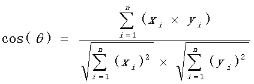

# 欧几里得距离、余弦相似性和皮尔逊相关系数


对于单维度数据可以用简单的均值、方差、标准差来评价，但对于多维度数据就不太合适了。例如对电影的评分，每部电影都是一个维度：

```
critics = {
    'Lisa Rose': {
        'Lady in the Water': 2.5,
        'Snakes on a Plane': 3.5,
        'Just My Luck': 3.0,
        'Superman Returns': 3.5,
        'You, Me and Dupree': 2.5,
        'The Night Listener': 3.0
    },
    'Gene Seymour': {
        'Lady in the Water': 3.0,
        'Snakes on a Plane': 3.5,
        'Just My Luck': 1.5,
        'Superman Returns': 5.0,
        'The Night Listener': 3.0,
        'You, Me and Dupree': 3.5
    },
    'Michael Phillips': {
        'Lady in the Water': 2.5,
        'Snakes on a Plane': 3.0,
        'Superman Returns': 3.5,
        'The Night Listener': 4.0
    }
}

```

上面数据摘自`集体智慧编程`，是多个用户对不同电影的评分。现在假如根据电影评分，来计算用户之间的品味的相似程度。


## 欧几里得距离

欧几里得距离是点与点的距离，将多个电影评分看成空间中的坐标点，距离越近的点说明两者品味越相似。剩下的问题就是如何将电影评分转换为空间中的坐标点。

我们以二维平面举例：将一步电影作为坐标系的横坐标，另一部电影作为纵坐标，那么所有人对这两部电影的评价都可以体现在这个平面，如下图：



这样就可以通过欧几里得距离公式来计算用户的相似性。两点间的距离很好计算，就是 sqrt( (x1-x2)^2 + (y1-y2)^2 )，值越小说明越相似。

下一步就是将二维扩展成多维，因为我们的电影有N多部。看下欧几里得距离公式：


公式表明本身就是针对多维坐标，因此完全不是问题，让我们来实现一下该公式。在实现公式之前，先将我们的数据格式转换一下，更好处理一些：

```
# 获取两个相比较的人的评分
def getMatrix(critics, personOne, personTwo):
    one = critics[personOne]
    two = critics[personTwo]

    arr1 = []
    arr2 = []
    for item in one:
        if item in two:
            arr1.append(one[item])
            arr2.append(two[item])

    return (arr1, arr2)
```

这样，两个人对所有评价过的电影分数用数组表示。再实现公式：

```
def euclideanDistance(critics, personOne, personTwo):
    (one, two) = getMatrix(critics, personOne, personTwo)

    sum = 0
    for idx in range(len(one)):
        sum += (one[idx] - two[idx]) ** 2

    distance = sum ** 0.5
    return distance
    
#调用
euclideanDistance(critics, 'Gene Seymour', 'Lisa Rose')
#output
#2.3979157616563596
```

距离计算出来了，有个小问题，假如只计算了'Gene Seymour'和'Lisa Rose'的相似度，你能知道两人的相似度到底是高还是低呢？所以结果用百分比的方式表示出来更直观些，而我们程序界更喜欢用0和1。即将distance转换为` 1 / (1 + distance)`，除数加1的目的是为了防止除数为零，结果在0到1之间，越靠近1说明越相似。

代码变成下面这个样子：

```
def euclideanDistance(critics, personOne, personTwo):
    (one, two) = getMatrix(critics, personOne, personTwo)
    
    sum = 0
    for idx in range(len(one)):
        sum += (one[idx] - two[idx]) ** 2

    distance = sum ** 0.5

    return 1 / (1 + distance )
    
#调用
euclideanDistance(critics, 'Gene Seymour', 'Lisa Rose')
#output
#0.29429805508554946
```


## 余弦相似性

欧几里得距离是通过点与点间的距离来判断相关性，而余弦相似性是通过点与点之间的夹角来判断相似性，角度越小说明越相似。




直接上公式：



这个公式很好理解，写代码实现：

```
def cosineCorrelation(critics, personOne, personTwo):
    (one, two) = getMatrix(critics, personOne, personTwo)
    oneArr = np.array(one)
    twoArr = np.array(two)

    sumcount = np.sum(oneArr * twoArr)
    
    oneSumSq = np.sum(oneArr ** 2)
    twoSumSq = np.sum(twoArr ** 2)
    divisor = (oneSumSq ** 0.5) * (twoSumSq ** 0.5)

    return sumcount / divisor

#调用
cosineCorrelation(critics, 'Gene Seymour', 'Lisa Rose')
#output
#0.9606463013980241
```

cos值本身就在0到1之间，所以不用自己进行转化。


## 皮尔逊相关系数

皮尔逊相关系数，其实就是在余弦相似性的基础上，对数据进行中心化（即数值减去均值）。也就是说先将数据中心化，然后再做余弦相似性计算，得到的就是皮尔逊相关系数。

```
def pearsonCorrelation(critics, personOne, personTwo):
    (one, two) = getMatrix(critics, personOne, personTwo)
    oneArr = np.array(one)
    twoArr = np.array(two)

    avgOne = np.sum(oneArr) / len(oneArr)
    avgTwo = np.sum(twoArr) / len(twoArr)
    oneArr -= avgOne
    twoArr -= avgTwo

    sumcount = np.sum(oneArr * twoArr)
    
    oneSumSq = np.sum(oneArr ** 2)
    twoSumSq = np.sum(twoArr ** 2)

    divisor = (oneSumSq ** 0.5) * (twoSumSq ** 0.5)

    return sumcount / divisor

#调用
pearsonCorrelation(critics, 'Gene Seymour', 'Lisa Rose')
#output
#0.39605901719066977
```


## 总结

欧几里得距离通过两点间的绝对距离进行相关性分析，距离越近相关性越大。而余弦相似性和皮尔逊相关系数体现的是方向上的差异，对距离不敏感。说白了，一个属于定量分析，一个属于定性分析。皮尔逊相关系数更像是余弦相似性的一种改进，就像标准差和方差一样。

